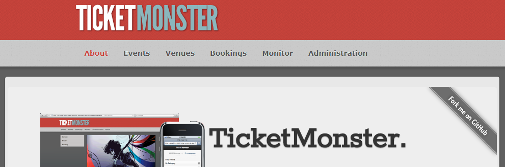

# Monolith to Microservices



We build upon the repo [monolith to microservices](https://github.com/dynatrace-innovationlab/monolith-to-microservice-openshift) repository but will adapt some steps here.
Basically, we'll try to avoid to build our artifacts by our own in this project. Instead, we will use pre-built docker images.

## Instructions

### Step 0: Prepare your environment

1. Set up a management zone to "filter" your own OpenShift project. Login to the Dynatrace tenant and create a management zone `wsXX` (XX... your assigned number). Please ask your instructor for Dynatrace tenant and login credentials.
<!--  `https://nbt24337.live.dynatrace.com/` -->

1. We will need some sources of the [monolith to microservices](https://github.com/dynatrace-innovationlab/monolith-to-microservice-openshift) repository, so we will clone it first.

    ```
    git clone https://github.com/dynatrace-innovationlab/monolith-to-microservice-openshift.git
    ```
    However, we will use prebuilt images during the course of the workshop to save some time.

1. Create the project in OpenShift
    ```
    oc login <OurClusterIP>
    ```
    your user: `wsXX` where XX... your assigned number<br>
    password: ask your instructor :) 
    
    After the successful login, create your own project:
    ```
    oc new-project wsXX
    ```

### Step 1: Create the database

1. Deploy a MySql database service
    ```
    oc new-app -e MYSQL_USER=ticket -e MYSQL_PASSWORD=monster -e MYSQL_DATABASE=ticketmonster mysql:5.5
    ```

1. Get the IP of the service
     ```
    oc get svc
    ```


### Step 2: Deploy the monolithic TicketMonster

lift and shift the monolith to OpenShift

1. Create new application
    ```
    oc new-app -e MYSQL_SERVICE_HOST=your-mysql-host -e MYSQL_SERVICE_PORT=3306 --docker-image=jetzlstorfer/ticket-monster-monolith:latest

    ```

1. Expose the TicketMonster service
    ```
    oc expose service ticket-monster-monolith --name=monolith 
    ```

1. Test your TicketMonster monolith

    Get the public IP of your ticketmonster:
    ```
    oc get routes
    ```
    Open a browser :)

### Step 3: decouple the UI from the monolith

1. For this step we need the `tm-ui-v1` sub-project.
    
1. Edit httpd conf to redirect service calls to the monolith which we use a our backend-service
    ```
    # proxy to redirect to the monolith
    ProxyPass "/rest" "http://backend-<YOURURL>/rest"
    ProxyPassReverse "/rest" "http://backend-<YOURURL>/rest"
    ```
    
1. Create another route for ticket monster monolith under the name "backend".
    ```
    oc expose service ticket-monster-monolith --name=backend
    oc get routes
    ```

1. Build, push and deploy the UI
    ```` 
    docker build -t jetzlstorfer/tm-ui-v1:latest .
    docker push jetzlstorfer/tm-ui-v1:latest
    oc new-app --docker-image=jetzlstorfer/tm-ui-v1:latest
    oc expose service tm-ui-v1
    ```` 


### Step 4: Generate load and hit the TicketMonster

optional - we skip this for now :)


### Step 5: Identify a microservice with the help of Dynatrace

Lets follow on [identifying a microservice](https://www.dynatrace.com/news/blog/monolith-to-microservices-how-to-identify-your-first-microservice/)

and [identifying its domain model](https://www.dynatrace.com/news/blog/monolith-to-microservices-the-microservice-and-its-domain-model/).


### Step 6: Build and deploy the microservice

1. Switch to the `orders-service/` directory.

1. Create the database for the microservice
    ```
    oc new-app -e MYSQL_USER=ticket -e MYSQL_PASSWORD=monster -e MYSQL_DATABASE=orders mysql:5.5 --name=orders-db
    ```
1. Setup database
    ```
    oc get pods

    oc rsync src/main/resources/db/migration/ <your-db-pod>:/var/lib/mysql
    ```
1. Connect to the DB pod and execute SQL statements 
    ```
    oc rsh <your-db-pod>
    cd ~
    mysql -u root orders < V1__0_ordersdb-schema.sql
    mysql -u root orders < V1__1_ordersdb-data.sql
    exit
    ```

1. Now the database is prepared to be able to store orders.

#### Deploy the microservice

1. Edit the database connection strings in the ```\src\main\resources\application-mysql.properties``` file:
    ```properties
    spring.datasource.legacyDS.url=jdbc:mysql://<yourticketmonsterdb>:3306/ticketmonster?useSSL=false
    spring.datasource.legacyDS.username=ticket
    spring.datasource.legacyDS.password=monster
    spring.datasource.legacyDS.driverClassName=com.mysql.jdbc.Driver

    spring.datasource.ordersDS.url=jdbc:mysql://<yourorderdb>:3306/orders?useSSL=false
    spring.datasource.ordersDS.username=ticket
    spring.datasource.ordersDS.password=monster
    spring.datasource.ordersDS.driverClassName=com.mysql.jdbc.Driver
    ```
    You'll get this information with
    ```
    oc get services
    ```
1. Build the application with Maven
    ```
    mvn clean install -P mysql,kubernetes fabric8:build -D docker.image.name=<yourdocker>/orders-service:latest -D skipTests
    ```
1. Build the Docker image in ```\target\docker\<your dockerhub account>\orders-service\latest\build\```
    ```
    docker build . -t <yourdocker>/orders-service:latest
    ``` 
1. Push the application to Dockerhub
    ```
    docker push <yourdocker>/orders-service:latest
    ```
1. Create a new application in OpenShift
    ```
    oc new-app --docker-image=<yourdocker>/orders-service:latest
    ```
1. Expose your microservice
    ```
    oc expose service orders-service
    ```

By the end of this steps, you have the orders service in place. In order to actually call this service, set the according feature flag in your FF4J console.

#### Deploy a new backend version for the microservice

```
oc new-app -e ORDERS_SERVICE_IP=orders-service-ws1.18.207.174.41.xip.io --docker-image=jetzlstorfer/backend-v2:latest
oc expose service backend-v2 
```

we need to reroute the backend route to hit the new backend service
```
oc set route-backends backend backend=0 backend-v2=100 
```


### Step 7: Switch feature flag and test your microservice

1. In your browser, navigate to your `ff4j` console: `https://<yourbackend<-XX.<ip>/ff4j-console` .
You will be able to switch on/off your new microservice from here. 

1. When making an order now the order will be operated and persisted by the OrderService instead of the monolithic booking service (in fact, the booking service calls the OrderService).

1. We can verify the service flow in Dynatrace. 


